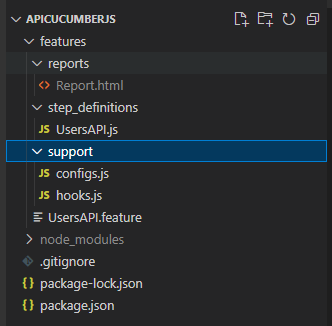

# APICucumberJS

This repo has the code which implements a API Test framework using BDD (Cucumber.js), SuperTest and JavaScript for the website, https://automationexercise.com/. It also features JSON Schema validation for the API's using Ajv JSON schema validator.

API list is available at https://automationexercise.com/api_list

Project setup guide is available in the PDF doc [APICucumberJS.pdf](APICucumberJS.pdf)

### **Folder Structure**

